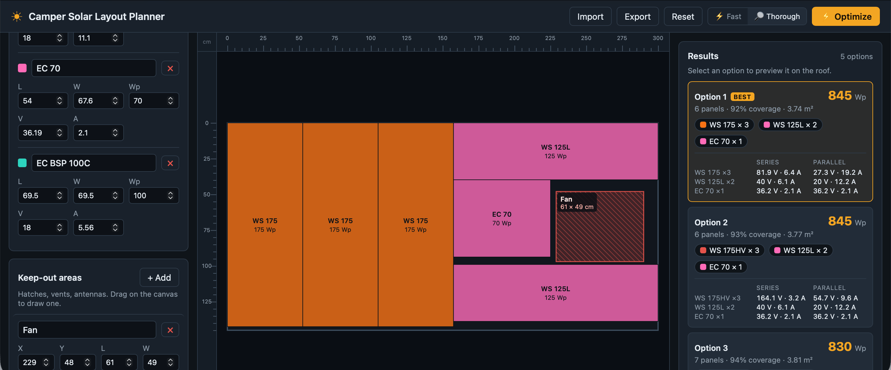
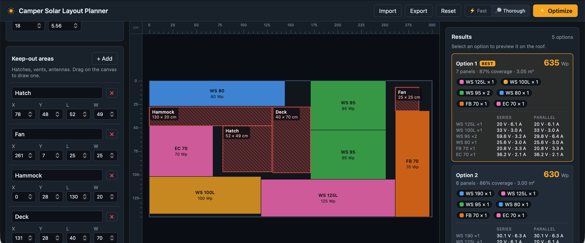

# Camper Solar Layout Planner

A browser-only web app for planning solar-panel placement on a camping-vehicle roof.
Define the usable roof area, mark keep-out zones (hatches, vents, antennas, etc), enter a
catalog of candidate panel models, and the app computes and visually displays an
optimized selection and placement that **maximizes total watt-peak (Wp)**.

## Examples

- Simple



- Complex




## Usage Hints

- The more panel options (esp. different shapes and sizes) you provide the "better" the result will be.
  - I put "better" in quotes here since the optimizer currently only consideres Wp achieved. 
    It doesn't take cost or number of MPPT controllers required into account.
- The `Fast` optimizer usually gives good results on simple layout
- The `Thorough` one usually gives noticeably better results on complex layouts with many keep-out zones.
- If you have the option, try moving the keep out zones and see if this gives better results

## Features

- **Roof dimensions** — length × width (cm) with configurable edge margin and
  inter-panel gap.
- **Keep-out areas** — add by dragging on the canvas or via the list; **drag to move**
  and **drag edges/corners to resize**. Each shows its live size, and while dragging or
  resizing, golden guide lines mark the edge positions and the clearance to each roof
  edge.
- **Grid snapping** — optional snap (Off / 1 / 5 / 10 cm) for all canvas edits, with a
  grid overlay at the coarser steps.
- **Canvas** — rulers on both axes, a mouse-position crosshair with a live cm readout,
  and color-coded panels labeled with model name and Wp.
- **Panel catalog** — any number of models (name, length, width, power in Wp). Optional
  **voltage** and **current** per model enable a series/parallel wiring readout.
- **Optimizer** — selects and places panels to maximize total Wp. Panels may be rotated
  90° and different models mixed. Two selectable effort levels:
  - **Fast** — an instant, deterministic heuristic sweep (the default).
  - **Thorough** — a deeper ~5-second search that runs in a Web Worker with live
    progress and a Cancel button; never returns a worse result than Fast.
- **Results** — up to 5 distinct layout options, each showing total Wp, panel count,
  coverage, used area, and a per-model breakdown ordered by Wp. When a model has voltage
  and current set, the box also lists the **series** and **parallel** voltage/current for
  that many identical panels.
- **Autosave** — the full configuration is saved to the Browser's `localStorage` and restored on reload.
- **Import / Export** — share or back up a configuration as JSON.


## How the optimizer works

The usable area is the roof inset by the edge margin, with each keep-out removed,
producing a set of free rectangles. Panels are packed as gap-inclusive footprints and
centered within them (so a panel can sit flush against a boundary). A greedy MaxRects
packer fills the rectangles trying both orientations per placement.

**Fast** runs that packer across many priority orderings (by Wp-density, area, power,
each-option-last, single-model fills, and seeded shuffles), three fit rules, three
orientation modes, and a set of *tightened geometries* (slightly enlarged keep-outs /
margins), keeping the highest-Wp result. It is deterministic.

**Thorough** is seeded with the Fast result and then runs a time-budgeted
**GRASP + ruin-and-recreate local search**: randomized greedy constructions, repeatedly
removing panels from a random region and re-filling, plus a pass that upgrades panels to
higher-power models that still fit. It streams its best layouts so a cancel keeps the
best found so far.

See `src/lib/packing.ts`, `src/lib/optimize.ts`, `src/lib/optimizeThorough.ts`, and
`src/lib/optimizer.worker.ts`.


## Development

```bash
npm install
npm run dev        # dev server
npm run test       # unit tests (geometry, packing, optimizers)
npm run check      # type-check
npm run build      # static production build -> dist/
```

The build is fully static — `dist/` can be hosted on any static file server.


## Tech

Svelte 5 + Vite + TypeScript. Canvas rendering. Web Worker for the thorough optimizer.
No backend.


## AI Disclaimer

This was largely built through the use of LLM coding agents. Do with that information what you will.
