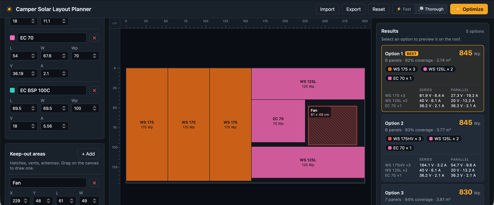
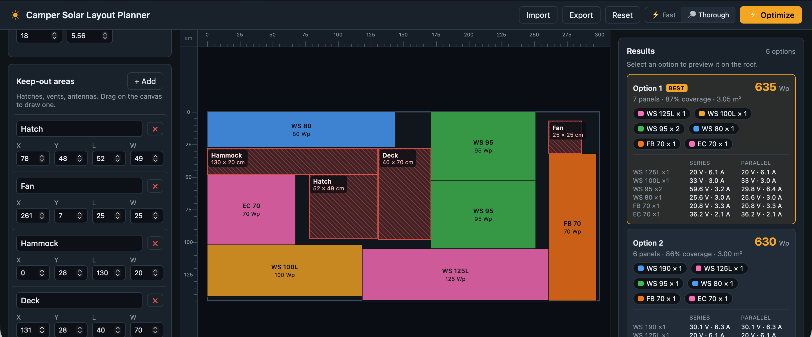

# Camper Solar Layout Planner

A browser-only web app for planning solar-panel placement on a camping vehicle.
Define one or more usable surfaces (roof, sidewalls, …), mark keep-out zones (hatches,
vents, antennas, etc), enter a catalog of candidate panel models, and the app computes and
visually displays an optimized selection and placement that
**maximizes total watt-peak (Wp)**.


https://ulope.github.io/camper-solar-layout-planner/


## Examples

- Simple



- Complex




## Usage Hints

- The more panel options (esp. different shapes and sizes) you provide the "better" the result will be.
  - The optimizer maximizes Wp achieved. If you also fill in **weight** and **price** per model
    you can add secondary criteria (see below) to break near-ties in favour of a lighter or
    cheaper build. The number of MPPT controllers required is still not considered.
- The `Fast` optimizer usually gives good results on simple layout
- The `Thorough` one usually gives noticeably better results on complex layouts with many keep-out zones.
- If you have the option, try moving the keep out zones and see if this gives better results

## Features

- **Surfaces** — plan any number of surfaces at once (roof plus one or two sidewalls,
  say), each with its own name, length × width (cm) and keep-outs. They are drawn stacked
  vertically on one canvas and all are optimized together. Edge margin and inter-panel gap
  are configured once and apply to every surface.
- **Keep-out areas** — belong to a surface; add by dragging on that surface in the canvas
  or via the list, **drag to move** and **drag edges/corners to resize**. Each shows its
  live size, and while dragging or resizing, golden guide lines mark the edge positions and
  the clearance to each edge of the surface it sits on.
- **Grid snapping** — optional snap (Off / 1 / 5 / 10 cm) for all canvas edits, with a
  grid overlay at the coarser steps.
- **Canvas** — all surfaces stacked vertically and labeled, with the one the sidebar
  edits highlighted. Rulers on both axes (the vertical one restarts at 0 per surface, so
  every reading is in that surface's own coordinates), a mouse-position crosshair with a
  live cm readout, and color-coded panels labeled with model name and Wp.
- **Panel catalog** — any number of models (name, length, width, power in Wp), listed as
  compact one-line entries; click one to edit it in a dialog. Optional **voltage** and
  **current** enable a series/parallel wiring readout, and optional **weight** and
  **price** feed the secondary optimization criteria.
- **Optimizer** — selects and places panels to maximize total Wp. Panels may be rotated
  90° and different models mixed. Effort and criteria live in the dropdown next to the
  Optimize button. Two effort levels:
  - **Fast** — an instant, deterministic heuristic sweep (the default).
  - **Thorough** — a deeper ~5-second search that runs in a Web Worker with live
    progress and a Cancel button; never returns a worse result than Fast.
- **Secondary criteria** *(optional)* — rank near-equal layouts by **weight**, **price**
  and/or **number of distinct panel models used**, in a priority order you choose. Total
  Wp remains the primary objective, and the adjustable **tolerance** (default 10%) applies
  at every level: only layouts within it of the best Wp are reordered, and among those, a
  later criterion decides between layouts within the tolerance of the earlier criterion's
  best value. Models missing a weight or price count as zero for that criterion, and the
  picker says how many are missing.
- **Results** — with more than one surface, a **combined** card totals the Wp, panel
  count, weight and price of the options currently selected across all surfaces, and each
  surface then gets its own section whose option you pick independently. Per surface, up to
  5 distinct layout options (plus the highest-Wp layout as an extra
  entry when secondary criteria pushed it out of the top five), each showing total Wp, panel count,
  coverage, used area, **total weight and price**, and a per-model breakdown ordered
  by Wp. A total is shown as `—` when no placed model carries that field and prefixed with
  `≥` when only some do, so a partial sum is never presented as exact. With secondary
  criteria active each option also states its **offset from the highest-Wp layout**
  (e.g. `−7.4% vs max Wp`), and that layout is always among the options shown. When a
  model has voltage
  and current set, the box also lists the **series** and **parallel** voltage/current for
  that many identical panels.
- **Autosave** — the full configuration is saved to the Browser's `localStorage` and restored on reload.
- **Import / Export** — share or back up a configuration as JSON. Files exported by
  earlier single-roof versions still import: the roof becomes the first surface, keeping
  its keep-outs.


## How the optimizer works

Each surface is packed independently — no placement constraint crosses a surface
boundary, so optimizing each on its own and summing gives the joint best total Wp. Per
surface, the usable area is the surface inset by the edge margin, with each keep-out
removed, producing a set of free rectangles. Panels are packed as gap-inclusive footprints and
centered within them (so a panel can sit flush against a boundary). A greedy MaxRects
packer fills the rectangles trying both orientations per placement.

**Fast** runs that packer across many priority orderings (by Wp-density, area, power,
each-option-last, single-model fills, and seeded shuffles), three fit rules, three
orientation modes, and a set of *tightened geometries* (slightly enlarged keep-outs /
margins), keeping the highest-Wp result. It is deterministic.

**Thorough** is seeded with the Fast result and then runs a time-budgeted
**GRASP + ruin-and-recreate local search**: randomized greedy constructions, repeatedly
removing panels from a random region and re-filling, plus a pass that upgrades panels to
higher-power models that still fit. It streams its best layouts so a cancel keeps the
best found so far.

Both effort levels keep the best layout of each distinct *panel composition* (the per-model
counts), so the candidate pool holds genuinely different builds rather than reshuffles of
the same one.

**Secondary criteria** are applied to that pool after the search, never during it: the
layouts within the tolerance band below the best total Wp are treated as equivalent and
sorted by the selected criteria in priority order (each lower-is-better), with total Wp as
the final tie-break. Layouts below the cutoff keep pure Wp order and always rank after the
band, so a criterion can never promote a layout that gives up more power than allowed.
Because each criterion depends only on a layout's composition, ranking the deduplicated
pool is exact.

The tolerance is what makes a *second* criterion reachable. Weight and price are
continuous, so demanding an exact tie before consulting the next criterion means it is
essentially never consulted — one real catalog produced 44 distinct weights across 56
candidate layouts. Instead each criterion peels off a tier: everything within the tolerance
of its best value is ranked by the next criterion, the remainder forms the following tier
under the same rule, and total Wp breaks the final tie. At tolerance 0 this reduces exactly
to lexicographic ordering. One consequence worth knowing: a single criterion no longer
guarantees the strict minimum — it guarantees "within the tolerance of the minimum, then
the most Wp".

See `src/lib/packing.ts`, `src/lib/optimize.ts`, `src/lib/optimizeThorough.ts`,
`src/lib/ranking.ts`, and `src/lib/optimizer.worker.ts`.


## Development

```bash
npm install
npm run dev        # dev server
npm run test       # unit tests (geometry, packing, optimizers)
npm run check      # type-check
npm run build      # static production build -> dist/
```

The build is fully static — `dist/` can be hosted on any static file server.


## Tech

Svelte 5 + Vite + TypeScript. Canvas rendering. Web Worker for the thorough optimizer.
No backend.


## AI Disclaimer

This was largely built through the use of LLM coding agents. Do with that information what you will.
